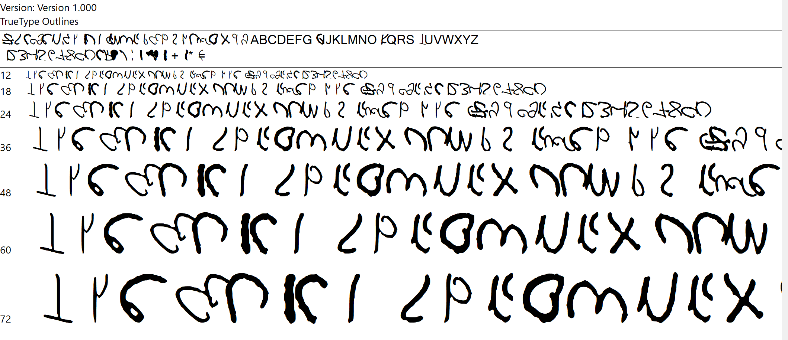
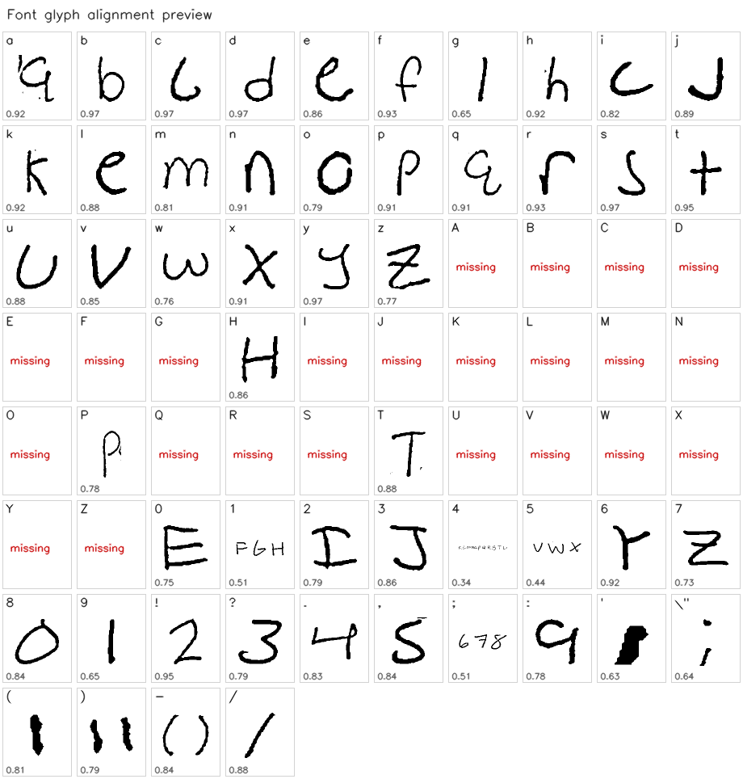
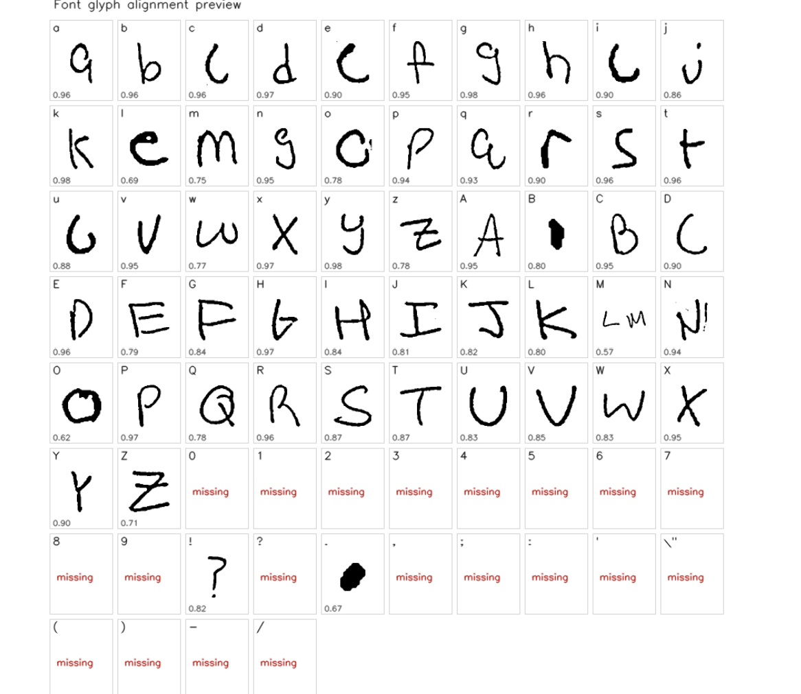
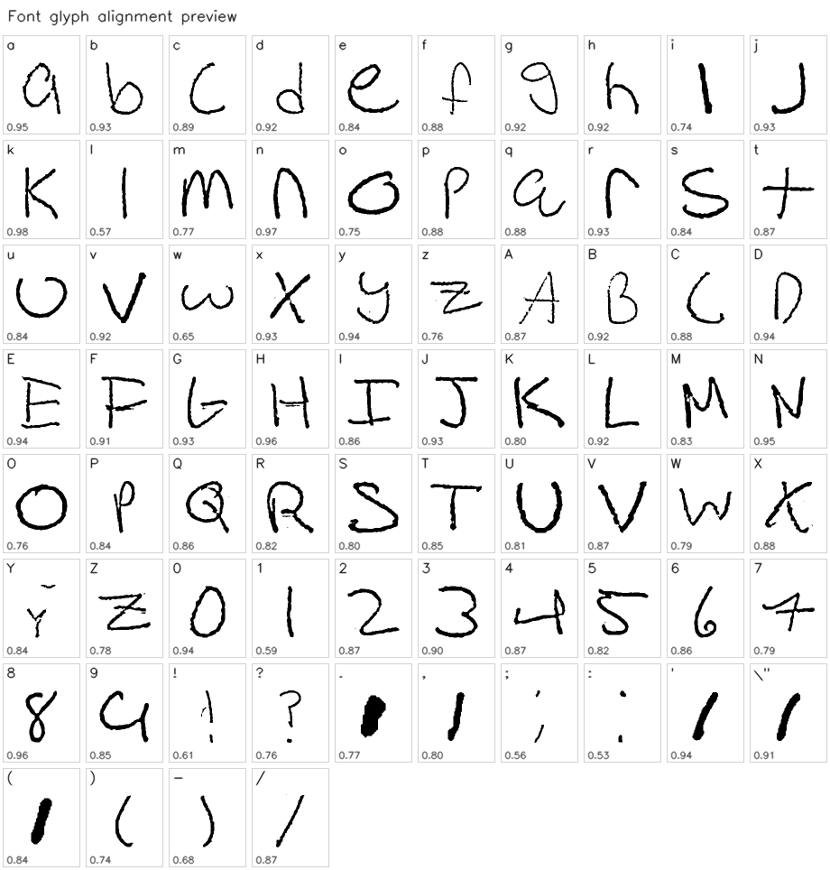

# HandwritingAI

> Turn your handwriting into text and into a font. Runs 100% locally on your computer.


---

## What it does

HandwritingAI is a local desktop app that analyses photos of your handwriting and does two things:

1. **Transcribe** - reads your handwriting and converts it to editable text
2. **Font generation** - extracts each character and packages them into an `.ttf` font you can install and use anywhere

Everything runs on your machine. No data is sent anywhere.

---

## How it works

```
Your photo  →  Preprocessing  →  Line segmentation
                                        │
                    ┌───────────────────┴───────────────────┐
                    ▼                                       ▼
           TrOCR model                           Character segmentation
           (transcription)                        (OpenCV connected components)
                    │                                       │
                    ▼                                       ▼
           Editable text                          Vectorize with potrace
                                                           │
                                                           ▼
                                                  Build .ttf with fonttools
```

---

## Quick start

### 1. Install

**macOS / Linux**
```bash
git clone https://github.com/Carter-Black/handwriting-ai.git
cd handwriting-ai
chmod +x install.sh
./install.sh
```

**Windows**
```
1. Clone or download this repo
2. Double-click install.bat
3. Follow the prompts
```

The installer handles everything automatically:

- Detects Python 3.10+ (tries `py`, `python`, `python3`; handles the Windows Store stub issue)
- Installs `potrace` automatically: brew, apt, dnf, or pacman on macOS/Linux; winget, chocolatey, or scoop on Windows, falling back to a direct download from sourceforge into `tools\potrace\` (no admin required). Manual install is only needed if every one of those fails.
- Creates a Python virtual environment
- Installs all Python dependencies
- Pre-downloads the TrOCR model (~300 MB, one time only)

> **Windows + potrace fallback:** if every auto-install attempt fails (rare; usually a network issue), grab it manually:
> 1. Download `potrace-X.X.win64.zip` from http://potrace.sourceforge.net/#downloading (the installer will open this page for you)
> 2. Unzip it
> 3. Copy `potrace.exe` into `tools\potrace\` inside this project (or any folder that's on your `PATH`)
> 4. Re-run `install.bat`

> **Windows note:** the installer uses plain ASCII output (`[OK]`, `[ERROR]`) for compatibility with all terminal types. If you see garbled characters, run it by double-clicking rather than from inside an existing terminal.

### 2. Run

```bash
./run.sh        # macOS / Linux (generated by install.sh)
```

On Windows, double-click **`run.bat`** (included in the repo, no need to generate it).

Open your browser at **http://localhost:8000**

---

## Usage guide

### Step 1 - Choose a mode

The tabs at the top change the guide shown on the page:

- **Transcribe:** no fixed prompt; upload the handwriting you want to read.
- **Generate font:** write the 3-line character guide exactly as shown. It covers lowercase letters, uppercase letters, digits, and common punctuation.
- **Fine-tune:** write the 3-line sentence prompt exactly as shown. Sentence-style samples train the recognizer on real word context instead of alphabet rows.

> **Use plain unlined white paper.** The line-detection algorithm uses horizontal projection to find rows of writing — printed lines on lined paper are picked up as content and break segmentation. If you need a writing guide, slide a lined sheet under translucent paper.
>
> **For best font results:** write in print (not cursive), clearly and consistently, with enough space that neighboring letters do not touch.
> **For best transcription/fine-tuning:** use your normal readable handwriting; print or light cursive is okay.

### Step 2 - Upload your photos

How many photos depends on what you want to do:

- **For transcription:** any number of photos, any number of lines per photo. Each is transcribed independently. Works on a single page or a 30-line letter.
- **For fine-tuning:** one or more photos, **each containing the full 3-line sentence prompt**. Photos with the wrong line count are skipped (with a console warning).
- **For font generation:** each photo should be a complete copy of the 3-line character guide, including the lowercase row, uppercase row, and digit/punctuation row. Multiple complete copies improve glyph quality; the app chooses the best aligned crop per character.

The app checks each photo for quality (blur, exposure, resolution) and flags any issues before processing starts.

### Step 3 - Run the selected tool

| Mode | What it does | Time (CPU) |
|------|-------------|------|
| **Transcribe** | Reads handwriting and outputs text via TrOCR | ~10–30 sec per page |
| **Fine-tune** | Trains the model on your handwriting style with augmentation | ~5–15 min |
| **Generate font** | Segments characters and builds a `.ttf` file | ~1–2 min |

The transcription tab has two toggles:

- **Use my fine-tuned model** — visible after you've fine-tuned at least once. Lets you compare base vs fine-tuned output without retraining.
- **Use larger model** — switches to `microsoft/trocr-large-handwritten` instead of `-base-`. See [Which model should I use?](#which-model-should-i-use) below.

There's also a **Delete fine-tuned model** link in the tools section at the bottom of the page if you want to start over.

### Which model should I use?

Two TrOCR variants are supported. The base model is loaded by default; the large one is opt-in via the **Use larger model** checkbox in the Transcribe tab.

| Model | Params | IAM CER | Download | When to use |
|-------|-------:|--------:|---------:|-------------|
| `microsoft/trocr-base-handwritten` | 334 M | 3.42 | ~334 MB | Default. Fast on CPU, fine-tunes in 5–15 min. Good for most legible handwriting. |
| `microsoft/trocr-large-handwritten` | 558 M | 2.89 | ~558 MB | Use when base output has substitution errors you want to fix. ~16% relative CER improvement on IAM benchmarks. Slower (2–3× per line) and ~1.7× memory. |

**Notes:**
- The large model is downloaded on demand the first time you check the toggle. It goes to the HuggingFace cache (`~/.cache/huggingface/hub/`) like the base model — not into the project folder.
- **Fine-tuning is base-only.** The saved fine-tuned model in `backend/storage/models/fine_tuned_trocr/` is a fine-tuned copy of `trocr-base-handwritten`. Fine-tuning the large model on CPU would take an hour+ per run, so the UI doesn't expose it. When **Use larger model** is checked, the fine-tuned variant is ignored.
- If neither base nor base-fine-tuned is producing good output, the large model is the next thing to try. If that also fails, your photo quality (lighting, focus, paper) is more likely the limiter than the recognizer.

### Fine-tuning

Fine-tuning teaches the model your specific handwriting style: slant, stroke thickness, baseline curvature, letter shapes. It uses the sentence prompt shown in the Fine-tune tab, not the font character rows, so the model keeps practicing realistic word sequences. The result is saved locally and used automatically next time you transcribe.

**Why this works without writing the prompt 100 times:** the trainer applies on-the-fly **data augmentation** — every training pass through your handwriting samples sees a slightly different version: rotated ±8°, blurred, with thicker/thinner strokes (dilation/erosion), with elastic warping, with downscaling, with brightness shift. Each variant is still your handwriting, just perturbed. The default 10× multiplier × 5 epochs turns a single 3-line photo into 150 training passes.

This follows the **DA2 augmentation strategy** documented in the [TrOCR paper §3.2](https://arxiv.org/abs/2109.10282), with elastic deformation per Simard, Steinkraus & Platt (ICDAR 2003) — research identifies elastic distortion as the highest-gain single augmentation for HTR ([arXiv:2508.11499](https://arxiv.org/abs/2508.11499)).

**What's tunable** (defaults in parentheses, all set in [backend/recognizer/model.py](backend/recognizer/model.py)):

| Parameter | Default | Effect |
|-----------|---------|--------|
| `epochs` | 5 | More = better fit but slower. 3 is the floor; >10 risks overfitting. |
| `learning_rate` | 2e-5 | Per [arXiv:2503.19546](https://arxiv.org/abs/2503.19546). 5e-5 (TrOCR's pretraining LR) is too aggressive for small fine-tunes. |
| `augment_multiplier` | 10 | Effective dataset size per epoch = real_pairs × multiplier. Raise to 20 for slower-but-stronger training. |
| Encoder freeze | OFF | The DLoRA-TrOCR ablation ([arXiv:2404.12734v3](https://arxiv.org/abs/2404.12734)) found decoder-only fine-tuning is the *worst* PEFT strategy for TrOCR. Visual style adaptation lives in the encoder, so we train both. |

**Honest expectations:** one clean sentence-prompt photo is enough to create a local fine-tune because augmentation turns 3 real lines into 150 training passes. More clean copies can still help, especially if your handwriting varies by size or slant. If a fine-tune hurts free-form transcription, use the base/large model toggle to compare outputs or delete the fine-tuned model from the tools section.

### Where files are stored

Most things this app creates land **inside the project folder**, but a few large items are stored elsewhere on your machine for caching reasons. Full disclosure:

| What | Where | Why there |
|------|-------|-----------|
| **Project source code** | The `handwriting-ai/` folder you cloned/copied | obvious |
| **Python virtual env** (~1–2 GB) | `<project>/.venv/` | created by the installer; bound to this project copy |
| **Uploaded photos** | `<project>/backend/storage/uploads/` | persisted between runs so jobs can finish in the background |
| **Generated fonts** | `<project>/backend/storage/fonts/MyHandwriting.ttf` | downloadable via the UI |
| **Fine-tuned model** (~1.4 GB) | `<project>/backend/storage/models/fine_tuned_trocr/` | local-only personalization, never leaves your machine |
| **Base TrOCR weights** (~334 MB) | HuggingFace cache: `~/.cache/huggingface/hub/` (Linux/macOS) or `C:\Users\<you>\.cache\huggingface\hub\` (Windows) | shared across all HuggingFace projects on your machine — if you delete this project folder, the cached model stays and is reused next time you reinstall |
| **Large TrOCR weights** (~558 MB) | Same HF cache location, downloaded on demand the first time you check **Use larger model** | same caching reason |
| **potrace binary** (~1 MB, Windows only) | `<project>/tools/potrace/potrace.exe` if the installer used the SourceForge download fallback; otherwise wherever your package manager put it (e.g. `C:\ProgramData\chocolatey\bin\` or your scoop shims) | bundled with project on Windows since potrace isn't standard there |

A fully installed + fine-tuned **project folder** is ~3 GB. The HF cache outside it adds another ~334 MB (or ~892 MB if you've used the large model too). To fully uninstall: delete the project folder AND the `models--microsoft--trocr-*` subdirectories inside the HF hub cache.

If your project folder is much larger than ~3 GB, you probably have leftover trainer checkpoints from an older version of the code — delete `backend/storage/models/fine_tuned_trocr/checkpoint-*` to reclaim that space.

---

## Project structure

```
handwriting-ai/
├── backend/
│   ├── main.py                  # FastAPI server + job queue
│   ├── recognizer/
│   │   ├── model.py             # TrOCR wrapper + fine-tuning
│   │   └── preprocess.py        # Quality checks, deskewing, binarization
│   └── font_generator/
│       ├── segmenter.py         # Line + character segmentation (OpenCV)
│       ├── vectorizer.py        # Bitmap to em-normalized SVG path (potrace)
│       └── builder.py           # SVG glyphs to .ttf (fonttools, cubics flattened to lines)
├── frontend/
│   └── index.html               # Local web UI
├── scripts/
│   └── test_htr.py              # CLI test script for the HTR pipeline
├── requirements.txt
├── run.bat                      # Windows launcher
├── install.sh                   # macOS / Linux installer
├── install.bat                  # Windows installer
├── tools/                       # auto-generated on first Windows install; holds potrace.exe if downloaded locally (gitignored)
└── .gitignore
```

---

## Dependencies

| Package | Purpose |
|---------|---------|
| `fastapi` + `uvicorn` | Local web server |
| `opencv-python` | Image processing, segmentation |
| `transformers` + `torch` | TrOCR model (HTR) |
| `potrace` (system) | Bitmap to vector tracing |
| `fonttools` | Building the `.ttf` font file (TrueType, cubics flattened to lines) |
| `Pillow` | Image loading and manipulation |

---

## ML approach

This project avoids training from scratch. It uses **Microsoft TrOCR** (`trocr-base-handwritten` by default, with `-large-` as an opt-in toggle), a pre-trained encoder-decoder Transformer that already understands English handwriting. Fine-tuning trains both the encoder and decoder on your samples with aggressive on-the-fly augmentation, takes 5–15 minutes on a CPU, and produces a personalized model saved entirely locally.

Generation parameters use the canonical TrOCR config (`num_beams=4, length_penalty=2.0, no_repeat_ngram_size=3, max_new_tokens=128, early_stopping=True`) shipped with the model's `generation_config.json`. A post-processor caps consecutive identical tokens at 3 to clean up beam search loops on out-of-distribution input (rows of standalone characters).

The font pipeline doesn't use ML at all — it's pure computer vision: forced prompt alignment with OpenCV connected components, potrace bitmap-to-vector tracing, then `fontTools` assembly of a TTF using flattened outlines with all Windows-required OS/2 / head / name fields set per the [OpenType spec recommendations](https://learn.microsoft.com/en-us/typography/opentype/spec/recom). If the prompt can't be aligned confidently, font generation is blocked and a labeled crop preview is shown instead.

---

## Testing

To test the HTR pipeline on a photo without running the full server:

```bash
source .venv/bin/activate   # or .venv\Scripts\activate on Windows
python scripts/test_htr.py path/to/your/photo.jpg

# save the preprocessed image to inspect it
python scripts/test_htr.py photo.jpg --save-preprocessed
```

---

## Development snapshots

I kept a few screenshots from the font-generation journey because the progress was honestly pretty satisfying to watch. It went from "that is absolutely not a font" to something close enough that I could actually type with my own handwriting.

<table>
  <tr>
    <td align="center"><strong>Not really a font yet</strong></td>
    <td align="center"><strong>First real signs of life</strong></td>
    <td align="center"><strong>Getting much closer</strong></td>
    <td align="center"><strong>Pretty much my handwriting</strong></td>
  </tr>
  <tr>
    <td></td>
    <td></td>
    <td></td>
    <td></td>
  </tr>
</table>

---

## Known limitations

- **Cursive writing** is harder to segment for font generation; print works best for fonts.
- **Lined paper** breaks line segmentation — use plain white paper. Printed rules are picked up as content by the horizontal projection algorithm.
- **Lighting matters** — avoid shadows across the paper.
- **Fine-tuning requires exactly 3 sentence lines per image** (matching the Fine-tune tab prompt). Photos with the wrong line count are skipped with a warning. Each label maps line-by-line to its corresponding handwritten line.
- **The font character guide is only for font generation.** Structured alphabet rows are out-of-distribution for TrOCR's RoBERTa decoder, so they are no longer used as the fine-tuning target.
- Tested on Python 3.10–3.14, macOS 13+, Ubuntu 22.04, Windows 10/11.

---

## Roadmap

- [ ] Cursive character segmentation (v2)
- [ ] Variable font support (weight/size variants)
- [ ] Batch transcription of multiple pages
- [ ] Export transcription as `.docx` / `.pdf`
- [ ] Drag-to-reorder glyph editor before font export

---

## Built with Claude Code and OpenAI Codex

Developed collaboratively with Claude Code and OpenAI Codex. The architecture and design calls are mine: local-only with no external APIs, TrOCR instead of training a recognizer from scratch, a projection + connected-components segmenter over a heavier ML approach, and a FastAPI job queue in place of a full task framework.

Claude and Codex accelerated the fiddly parts. Highlights from the build:
- Diagnosed the **`flagCubic` "shattered glyph" bug** in TTF generation — `TTGlyphPen.curveTo()` quietly emits cubic-extension bytes that Windows GDI can't decode, producing the classic "random lines" rendering. Switched to `Cu2QuPen` (the ufo2ft path) and added a one-line diagnostic to detect the flag in any future builds.
- Tracked down the **potrace relative-command parser bug** where lowercase SVG commands like `c` were ignored, causing valid glyph outlines to turn into diagonal slash/starburst geometry.
- Caught the **`Seq2SeqTrainer save_strategy="epoch"` disk-bloat bug** writing ~12 GB of optimizer-state checkpoints per fine-tune, never reused.
- Fixed the **fine-tune label-misalignment bug** where `_split_text` was chunking the prompt by word count instead of by line, training the model on (line_image, wrong_text) pairs and overfitting on whichever phrase happened to dominate.
- Tracked down a **UTF-8 parser issue in `install.bat`** where cmd.exe was fragmenting commands on multi-byte characters.
- Implemented the **DA2 augmentation pipeline** (rotation, blur, dilation, erosion, downscaling, noise, brightness shift, elastic deformation) so fine-tuning can extract signal from a single prompt photo instead of requiring a large handwriting dataset.

Several of those fixes came out of dedicated Claude, GPT Research, and Codex sessions targeting the font and transcription failure modes specifically — the research and debugging were good enough that the resulting code changes followed directly from the reports.

Combined human + AI development is the direction things are heading; this project is a deliberate lean into that workflow as much as I could while still maintaining control over things every step along the way.

---

## License

MIT; do whatever you want with it.

---

*Built with TrOCR, OpenCV, potrace, and fonttools.*
